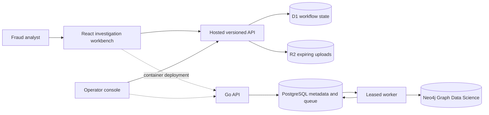

# Architecture

The hosted path maximizes reviewer reliability while storing real identity-aware workflow state and files. The container path demonstrates the production service boundary: the API enqueues, workers claim with `FOR UPDATE SKIP LOCKED`, heartbeats extend leases, and graph projections are cleaned before a run becomes successful.
